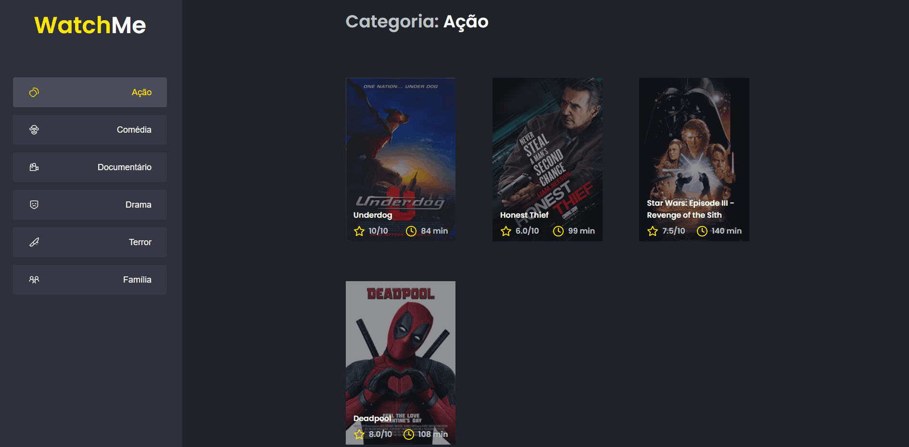

<h1 align="center"></h1>

<h3 align="center">Performando aplicação Watch Me</h3>

<p align="center">“Software developers are students forever 🧠”</p>

<p align="center">
  <a href="#about">Sobre</a>&nbsp;&nbsp;&nbsp;|&nbsp;&nbsp;&nbsp;
  <a href="#install">Instalação</a>&nbsp;&nbsp;&nbsp;|&nbsp;&nbsp;&nbsp;
  <a href="#challenge">Desafios</a>&nbsp;&nbsp;&nbsp;|&nbsp;&nbsp;&nbsp;
  <a href="#technologies">Tecnologias</a>
</p>

## :speech_balloon: Sobre <a name="about"></a>

> Esse desafio foi proposto com intuito de performar uma aplicação já existente, chamada de [Watch Me](https://github.com/douglasscaini/watch-me). Adicionando assim, técnicas como Memo, useMemo e useCallback.

## Memo

Técnica utilizada para performar componentes. Não deixa atualizar a renderização.

Trás alguns benefícios quando utilizado em:

- Componentes puros.
- Componentes que renderizam muito.
- Quando um componente renderiza com as mesmas props.
- Quando o projeto está de médio para grande.

Exemplo de aplicação:

```
export const ProductItem = memo(ProductItemComponent, (prevProps, nextProps) => {
  return Object.is(prevProps.product, nextProps.product);
});
```

## useMemo

É uma forma para performar algo complexo (geralmente cálculos) dentro da aplicação.

Dois casos de uso são:

- Cálculos pesados.
- Igualdade referencial (quando passa uma informação a um componente filho).

## useCallback

Usado para igualdade referencial de funções. Utilizado geralmente quando se tem prop drilling.

Também deve-se transformar a função em uma constante:

```
const addToWishlist = useCallback(async (id: number) => {
  console.log(id);
}, []);
```

<br />
<table>
  <tr>
    <td colspan="1">App</td>
  </tr>
  <tr>
    <td></td></td>
  </tr>
</table>

## :warning: Instalação <a name="install"></a>

```bash
# Instalar as dependências necessárias:
$ yarn

# Iniciar o servidor:
$ yarn server

# Iniciar o projeto:
$ yarn dev

```

## :triangular_flag_on_post: Desafio <a name="challenge"></a>

> Aplicabilidade das técnicas apresentadas acima (Memo, useMemo e useCallback).

## :heavy_check_mark: Tecnologias <a name="technologies"></a>

- [ReactJS](https://pt-br.reactjs.org/)

---

by [Douglas Scaini](https://www.github.com/douglasscaini) ❤️
